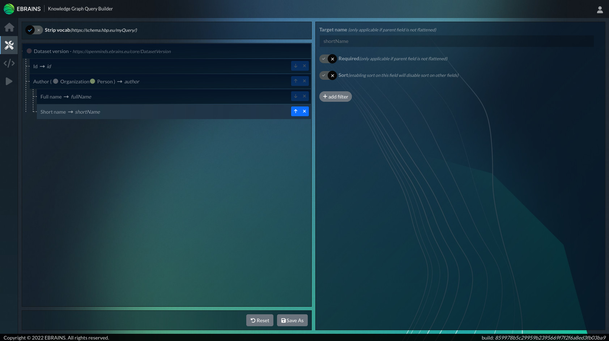

# KG Query Builder

*Use the KG Query Builder to design your own queries on the EBRAINS Knowledge Graph*

### Query the data you need - in the shape you want!

The EBRAINS Knowledge Graph comes with a comfortable way of defining your own queries and just ask for the data you're interested in: The KG Query Builder.

This convenient tool allows you to select the types, fields and relations you're interested in and lets you execute the query against the Knowledge Graph database in no-time and use it e.g. for reports or further processing.

But there's more: if you want to reuse your query and/or are a developer, you can store your query by giving it a name on the Knowledge Graph. You can then execute this query all over again and access it by an API.

Advanced filter mechanisms allowing you to restrict your results by: text patterns and regular expressions let you narrow down your search result to exactly what you're looking for.

#### Features

- Easy-to-use query definition via UI
- Immediate execution of the query for short feedback cycles
- Ensured access permissions based on the user-login
- Save and load specifications in the KG
- Call your stored queries through an API
- Rename fields and restructure the response to your needs
- Make use of the full power of semantics (JSON-LD) or reduce your results to easy-to-process standard JSON
- Query high quality data only or lookup preliminary (non-published) data (depends on your access rights)
- Advanced filter mechanisms (static or dynamically definable by parameters)
